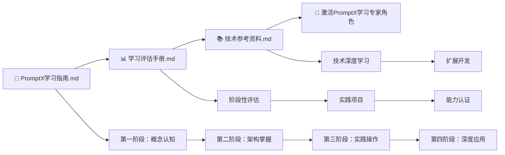

# PromptX 学习体系

> **精简高效的 PromptX 项目学习方案**
> 遵循奥卡姆剃刀原则，3 个核心文件完成完整学习体系

## 🎯 学习体系概览

基于奥卡姆剃刀原则，我们将原有的 8 个分散文件整合为 3 个核心文件，形成了简洁高效的学习体系：

```
8个分散文件 → 3个核心文件
复杂的多文件跳转 → 一站式学习体验
内容重复冗余 → 精简高效指导
```

## 📚 核心文件说明

### 1. 📖 PromptX 学习指南.md

**唯一学习入口 | 完整学习路径**

- **内容整合**：小白入门路径 + 目录结构详解 + 学习进度跟踪
- **学习阶段**：概念认知 → 架构掌握 → 实践操作 → 深度应用
- **核心特色**：
  - 四个学习阶段，每个阶段都有明确的目标和检查点
  - 详细的文件路径指导，知道每一步要学什么文件
  - 循序渐进的学习任务，从概念到实践的完整覆盖
  - 自我检验清单，确保学习效果

### 2. 📊 学习评估手册.md

**学习效果验证 | 能力认证体系**

- **内容整合**：阶段性评估体系 + 实践项目模板 + 个性化改进建议
- **评估维度**：知识掌握、技能应用、问题解决、创新能力
- **核心特色**：
  - 四层评估模型，科学评估学习进度
  - 实践项目模板，理论与实践相结合
  - 个性化改进建议，针对性提升方案
  - 权威能力认证，PromptX 项目专家等级认定

### 3. 📚 技术参考资料.md

**深度技术资料 | 开发参考手册**

- **内容整合**：技术架构分析 + PromptX 项目学习计划 + 开发规范
- **技术深度**：系统架构、协议详解、核心组件、扩展开发
- **核心特色**：
  - 完整的技术架构图和设计理念
  - DPML 协议和 MCP 协议的详细说明
  - 锦囊框架、资源管理、记忆系统的技术实现
  - 扩展开发指南和最佳实践

## 🚀 如何开始学习

### 推荐学习顺序



### 立即开始

1. **第一步**：打开 `PromptX学习指南.md`，从第一阶段开始学习
2. **第二步**：在每个阶段结束后，使用 `学习评估手册.md` 进行自我评估
3. **第三步**：需要深入了解技术细节时，查阅 `技术参考资料.md`
4. **第四步**：激活 PromptX 学习专家角色获得个性化指导

## 🎭 PromptX 学习专家角色

我们为您创建了专门的 PromptX 学习专家角色，位于：
`.promptx/resource/role/PromptX-learning-expert/`

### 激活方式

```bash
# 刷新注册表（如果需要）
nPromptX promptx init

# 激活学习专家角色
nPromptX promptx action PromptX-learning-expert
```

### 专家角色特点

- **项目深度理解**：完全掌握 PromptX 项目的架构和核心机制
- **个性化指导**：根据学习者背景调整学习内容和进度
- **全程陪伴**：从入门到精通的完整学习支持
- **阶段性评估**：科学评估学习进度和效果

## 💡 体系优势

### 1. 简洁高效

- **文件数量**：从 8 个减少到 3 个
- **认知负载**：大幅降低学习复杂度
- **使用体验**：一站式学习，无需多文件跳转

### 2. 内容整合

- **消除重复**：去除了原有文件间的重复内容
- **逻辑清晰**：每个文件都有明确的功能定位
- **相互补充**：三个文件形成完整的学习闭环

### 3. 实用导向

- **学习路径**：从理论到实践的完整路径
- **评估体系**：科学的能力评估和认证
- **技术深度**：满足深度学习和开发需求

### 4. 个性化支持

- **专业角色**：专门的学习专家角色
- **改进建议**：根据评估结果提供个性化建议
- **持续优化**：基于学习效果不断改进

## 🎯 学习目标

通过这个精简的学习体系，您将：

- ✅ **快速入门**：通过清晰的学习路径快速掌握 PromptX 项目
- ✅ **深度理解**：系统掌握 PromptX 项目的架构和核心技术
- ✅ **实践能力**：具备独立开发和扩展 PromptX 项目的能力
- ✅ **专家认证**：获得 PromptX 项目专家等级认证
- ✅ **持续提升**：建立持续学习和改进的机制

## 📋 学习检查清单

### 文件使用检查

- [ ] 已阅读 `PromptX学习指南.md` 的学习目标和前提条件
- [ ] 已了解 `学习评估手册.md` 的评估体系和标准
- [ ] 已浏览 `技术参考资料.md` 的技术架构概览
- [ ] 已成功激活 `PromptX-learning-expert` 角色

### 学习进度检查

- [ ] 完成第一阶段：概念认知（2-3 天）
- [ ] 完成第二阶段：架构掌握（3-4 天）
- [ ] 完成第三阶段：实践操作（2-3 天）
- [ ] 完成第四阶段：深度应用（3-5 天）

### 能力认证检查

- [ ] 通过第一阶段评估（85 分以上优秀）
- [ ] 通过第二阶段评估（85 分以上优秀）
- [ ] 通过第三阶段评估（85 分以上优秀）
- [ ] 通过第四阶段评估（85 分以上高级专家）

## 📞 学习支持

### 获得帮助

- **专家角色**：随时激活 PromptX 学习专家角色获得指导
- **评估反馈**：使用评估手册获得个性化改进建议
- **技术参考**：查阅技术参考资料解决具体问题
- **社区支持**：参与 PromptX 项目社区讨论和交流

### 持续改进

- **定期评估**：使用评估手册定期检查学习进度
- **及时调整**：根据评估结果调整学习策略
- **实践验证**：通过实际项目验证学习效果
- **知识更新**：关注 PromptX 项目更新，持续学习新特性

---

现在您拥有了一个完整、简洁、高效的 PromptX 项目学习体系。遵循奥卡姆剃刀原则，我们用最少的文件提供最完整的学习体验。开始您的 PromptX 学习之旅吧！

**立即开始**：打开 `PromptX学习指南.md` 开始第一阶段的学习！
