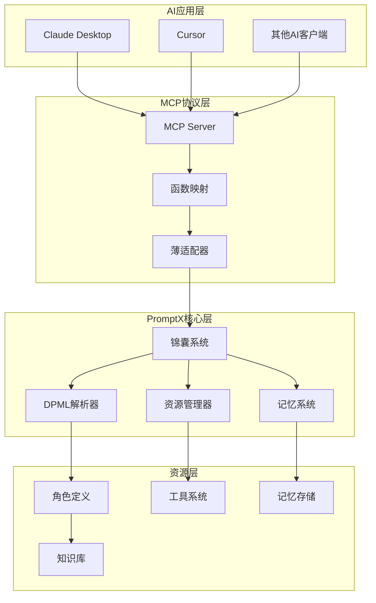
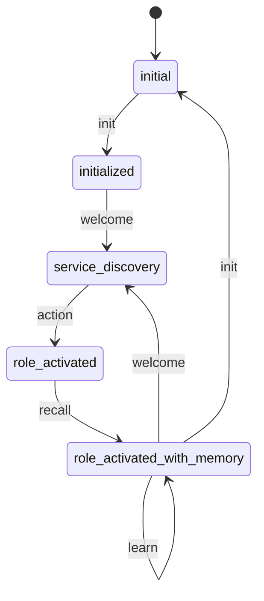

# 技术参考资料

> **PromptX 项目深度技术资料**
> 系统架构、技术实现、开发规范的完整参考文档

## 📐 系统架构设计

### 整体架构图



### 核心设计理念

**"AI use CLI get prompt for AI"**

- AI 通过命令行接口获取提示词来增强自身能力
- 这不是简单的工具调用，而是一个完整的 AI 能力循环增强系统
- 实现了从传统 AI 工具到主动学习专业助手的转变

### 四层双提示词循环架构

1. **👑 Master (人类主控)**

   - 身份：决策制定者，系统的最终用户
   - 职责：提出需求和目标，做出关键决策，评估 AI 的服务质量
   - 交互方式：自然语言（用户提示词）

2. **🤖 AI (智能中间层)**

   - 身份：智能代理，核心协调者
   - 职责：理解需求，判断所需专业能力，操作 PromptX 系统，内化系统提示词
   - 特点：双重身份 - 既是 Master 的服务者，又是 PromptX 的用户

3. **🖥️ Interface Layer (接口层)**

   - 身份：AI 的操作界面，系统的用户界面
   - 职责：提供标准化的操作接口，解析操作指令，格式化返回结果
   - 接口类型：CLI 接口、RESTful API、WebSocket 接口

4. **💻 PromptX System (系统层)**
   - 身份：核心计算系统，资源管理器
   - 职责：存储和管理 DPML 格式的专业知识，解析和执行命令，维护系统状态
   - 核心能力：高效的知识检索和状态管理

---

## 🔤 DPML 协议详解

### 设计理念

DPML (Deepractice Prompt Markup Language) 是专为提示词工程设计的语义化标记语言：

- **自然语言驱动**：提示词本质是自然语言的结构化表达
- **释义即实现**：AI 理解语义的过程就是执行过程
- **语义透明性**：标签名称具有自解释性

### 核心语法结构

```xml
<role>
  <personality>
    @!thought://domain-specific-thinking
    我是专业的[领域]专家，具备[核心特征]...
  </personality>
  <principle>
    @!execution://domain-workflow
    @!execution://quality-standards
  </principle>
  <knowledge>
    仅写项目特定的约束和Sean原创概念...
  </knowledge>
</role>
```

### 三组件架构

#### 1. Personality (思维模式编排)

- **作用**：定义 AI 角色的思考方式和认知模式
- **语法**：`@!thought://` 引用思维模式
- **内容**：角色的核心身份、专业特征、认知偏好

#### 2. Principle (行为模式编排)

- **作用**：定义 AI 角色的执行方式和工作原则
- **语法**：`@!execution://` 引用行为模式
- **内容**：工作流程、质量标准、处理原则

#### 3. Knowledge (知识体系编排)

- **作用**：定义专业领域的结构化知识体系
- **语法**：`@!knowledge://` 引用知识模块
- **内容**：仅写 Sean 原创概念和项目特定约束

### 引用机制

```xml
<!-- 强制引用：必须成功解析 -->
@!thought://judicial-thinking

<!-- 可选引用：允许解析失败 -->
@?knowledge://optional-knowledge

<!-- 直接引用：基础引用方式 -->
@execution://basic-process
```

### 协议实现绑定

```xml
<store:execution>
  # 存储操作通过execution协议实现
  具体的存储逻辑和流程
</store:execution>

<recall:resource>
  # 检索操作通过resource协议实现
  具体的检索逻辑和策略
</recall:resource>
```

---

## 🔌 MCP 协议集成

### 技术架构

MCP (Model Context Protocol) 是连接 AI 客户端和 PromptX 系统的桥梁：

```javascript
// 零开销调用路径
MCP请求 → 参数映射 → cli.execute() → PouchOutput → MCP响应
```

### 六大核心工具

#### 1. promptx_init

```javascript
{
  name: "promptx_init",
  description: "初始化PromptX工作环境",
  parameters: {
    workingDirectory: "工作目录绝对路径",
    ideType: "IDE类型（可选）"
  }
}
```

#### 2. promptx_welcome

```javascript
{
  name: "promptx_welcome",
  description: "发现可用的专业角色",
  parameters: {} // 无参数
}
```

#### 3. promptx_action

```javascript
{
  name: "promptx_action",
  description: "激活指定的专业角色",
  parameters: {
    role: "角色ID，如copywriter, product-manager"
  }
}
```

#### 4. promptx_learn

```javascript
{
  name: "promptx_learn",
  description: "学习指定的专业资源",
  parameters: {
    resource: "资源URL，如@role://copywriter"
  }
}
```

#### 5. promptx_recall

```javascript
{
  name: "promptx_recall",
  description: "检索相关记忆",
  parameters: {
    role: "角色ID",
    query: "检索关键词（可选）"
  }
}
```

#### 6. promptx_remember

```javascript
{
  name: "promptx_remember",
  description: "保存重要信息",
  parameters: {
    role: "角色ID",
    content: "要保存的内容",
    tags: "标签，空格分隔（可选）"
  }
}
```

### PATEOAS 状态机



---

## 🎯 锦囊框架 (Pouch Framework)

### 设计理念

基于 PATEOAS (Prompt as the Engine of Application State) 理念的 AI-First CLI 框架：

- **自包含的专家知识单元**：独立执行，不依赖上下文
- **状态驱动的导航系统**：通过 PATEOAS 引导下一步操作
- **AI 友好的接口设计**：专为 AI 使用而优化

### 核心组件

```javascript
// 基础命令抽象类
class BasePouchCommand {
  getPurpose() {
    return "命令的目的说明";
  }

  async getContent(args) {
    return "核心内容（提示词）";
  }

  getPATEOAS(args) {
    return {
      currentState: "current-state",
      availableTransitions: ["next-command"],
      nextActions: [
        {
          name: "下一步操作",
          description: "操作描述",
          command: "promptx next-command",
        },
      ],
    };
  }
}
```

### 命令系统

#### InitCommand - 初始化命令

```javascript
class InitCommand extends BasePouchCommand {
  getPurpose() {
    return "初始化工作环境，创建必要的配置目录和文件";
  }

  async getContent(args) {
    // 创建 .promptx 目录
    // 生成项目资源注册表
    // 配置MCP连接
    return "初始化完成信息";
  }
}
```

#### WelcomeCommand - 角色发现命令

```javascript
class WelcomeCommand extends BasePouchCommand {
  getPurpose() {
    return "发现并展示所有可用的专业角色";
  }

  async getContent(args) {
    // 扫描系统角色
    // 扫描用户自定义角色
    // 生成角色清单
    return "角色发现结果";
  }
}
```

#### ActionCommand - 角色激活命令

```javascript
class ActionCommand extends BasePouchCommand {
  getPurpose() {
    return "激活指定角色，加载其完整定义和能力";
  }

  async getContent(args) {
    // 解析角色定义
    // 加载依赖资源
    // 渲染完整提示词
    return "激活后的角色定义";
  }
}
```

### 三层输出结构

每个锦囊都输出三层信息：

1. **Purpose（目的）**：说明锦囊的作用
2. **Content（内容）**：核心提示词或知识
3. **PATEOAS（导航）**：下一步操作指引

---

## 🗂️ 资源管理系统

### 资源协议体系

```javascript
// 统一资源协议
@role://video-copywriter           // 角色定义
@thought://creative-thinking       // 思维模式
@execution://content-creation      // 执行框架
@knowledge://domain-knowledge      // 专业知识
@memory://success-cases           // 历史经验
@tool://calculator                // 工具定义
@manual://tool-usage              // 工具手册
@package://tool-package           // 工具包
@project://specific-config        // 项目配置
@file://local-resource            // 本地文件
@prompt://template-id             // 提示词模板
@user://custom-resource           // 用户资源
```

### 资源发现机制

```javascript
class DiscoveryManager {
  async discoverResources(baseDir) {
    const discoveries = [
      new FilePatternDiscovery(),
      new PackageDiscovery(),
      new ProjectDiscovery(),
      new CrossPlatformFileScanner(),
    ];

    const resources = [];
    for (const discovery of discoveries) {
      const found = await discovery.discover(baseDir);
      resources.push(...found);
    }

    return resources;
  }
}
```

### 资源注册表

```json
{
  "version": "1.0.0",
  "timestamp": "2025-01-01T00:00:00.000Z",
  "resources": {
    "role": {
      "nuwa": {
        "path": "resource/role/nuwa/nuwa.role.md",
        "type": "role",
        "title": "女娲 - AI角色创造专家"
      }
    },
    "thought": {
      "role-creation": {
        "path": "resource/role/nuwa/thought/role-creation.thought.md",
        "type": "thought",
        "title": "角色创造思维模式"
      }
    }
  }
}
```

---

## 🧠 记忆系统架构

### 记忆存储机制

```javascript
class MemorySystem {
  async remember(role, content, tags = []) {
    // 1. 内容智能处理
    const processed = await this.processContent(content);

    // 2. 价值评估
    const value = await this.evaluateValue(processed);

    // 3. 标签生成
    const autoTags = await this.generateTags(processed);

    // 4. 存储到角色专属记忆库
    await this.store(role, {
      content: processed,
      tags: [...tags, ...autoTags],
      value: value,
      timestamp: Date.now(),
    });
  }

  async recall(role, query = "") {
    // 1. 语义搜索
    const semanticMatches = await this.semanticSearch(role, query);

    // 2. 关键词匹配
    const keywordMatches = await this.keywordSearch(role, query);

    // 3. 时间关联
    const timeMatches = await this.timeBasedSearch(role);

    // 4. 结果合并和排序
    return this.mergeAndRank([
      ...semanticMatches,
      ...keywordMatches,
      ...timeMatches,
    ]);
  }
}
```

### 记忆价值评估

```javascript
class ValueEvaluator {
  evaluate(content) {
    const criteria = [
      this.isUserSpecificInfo(content), // 用户特定信息
      this.isProjectSpecificInfo(content), // 项目特定信息
      this.isExperientialInfo(content), // 经验性信息
      this.isCorrectionInfo(content), // 纠错性信息
    ];

    return criteria.reduce((score, criterion) => {
      return score + (criterion ? 25 : 0);
    }, 0);
  }
}
```

---

## 🔧 工具系统架构

### 工具沙箱机制

```javascript
class ToolSandbox {
  constructor() {
    this.isolation = new SandboxIsolationManager();
    this.validator = new ToolValidator();
    this.errorManager = new SandboxErrorManager();
  }

  async executetool(toolResource, parameters) {
    // 1. 工具验证
    await this.validator.validate(toolResource, parameters);

    // 2. 沙箱隔离
    const sandbox = await this.isolation.create();

    // 3. 工具执行
    try {
      const result = await sandbox.execute(toolResource, parameters);
      return result;
    } catch (error) {
      return this.errorManager.handleError(error);
    } finally {
      await sandbox.cleanup();
    }
  }
}
```

### 工具开发规范

```javascript
// 工具定义示例
const toolDefinition = {
  name: "calculator",
  description: "基础数学计算工具",
  parameters: {
    type: "object",
    properties: {
      expression: {
        type: "string",
        description: "数学表达式",
      },
    },
    required: ["expression"],
  },

  async execute(params) {
    // 工具实现逻辑
    return eval(params.expression);
  },
};
```

---

## 📊 性能优化策略

### 1. 资源缓存机制

```javascript
class ResourceCache {
  constructor() {
    this.cache = new Map();
    this.ttl = 15 * 60 * 1000; // 15分钟
  }

  get(key) {
    const item = this.cache.get(key);
    if (!item) return null;

    if (Date.now() - item.timestamp > this.ttl) {
      this.cache.delete(key);
      return null;
    }

    return item.data;
  }

  set(key, data) {
    this.cache.set(key, {
      data,
      timestamp: Date.now(),
    });
  }
}
```

### 2. 懒加载机制

```javascript
class LazyLoader {
  constructor() {
    this.loaded = new Set();
    this.loading = new Map();
  }

  async load(resourceId) {
    if (this.loaded.has(resourceId)) {
      return this.getFromCache(resourceId);
    }

    if (this.loading.has(resourceId)) {
      return this.loading.get(resourceId);
    }

    const promise = this.loadResource(resourceId);
    this.loading.set(resourceId, promise);

    try {
      const result = await promise;
      this.loaded.add(resourceId);
      this.loading.delete(resourceId);
      return result;
    } catch (error) {
      this.loading.delete(resourceId);
      throw error;
    }
  }
}
```

### 3. 并行处理优化

```javascript
class ParallelProcessor {
  async processResources(resources) {
    // 批量并行处理
    const chunks = this.chunk(resources, 5);
    const results = [];

    for (const chunk of chunks) {
      const chunkResults = await Promise.all(
        chunk.map((resource) => this.processResource(resource))
      );
      results.push(...chunkResults);
    }

    return results;
  }
}
```

---

## 🚀 部署和运维

### 开发环境配置

```json
{
  "scripts": {
    "start": "PROMPTX_ENV=development node src/bin/promptx.js",
    "test": "jest",
    "lint": "eslint src/",
    "build": "webpack --mode production"
  },
  "dependencies": {
    "@modelcontextprotocol/sdk": "^1.12.1",
    "commander": "^11.0.0",
    "express": "^5.1.0",
    "fs-extra": "^11.1.0",
    "glob": "^10.3.0",
    "yaml": "^2.3.0"
  }
}
```

### 生产环境优化

```javascript
// 生产环境配置
const productionConfig = {
  // 缓存策略
  cache: {
    enabled: true,
    ttl: 30 * 60 * 1000, // 30分钟
    maxSize: 1000,
  },

  // 并发控制
  concurrency: {
    maxConcurrent: 10,
    timeout: 30000,
  },

  // 日志配置
  logging: {
    level: "info",
    format: "json",
    transport: "file",
  },
};
```

### 错误处理和监控

```javascript
class ErrorHandler {
  constructor() {
    this.logger = new Logger();
    this.metrics = new Metrics();
  }

  handleError(error, context) {
    // 记录错误
    this.logger.error({
      error: error.message,
      stack: error.stack,
      context: context,
      timestamp: Date.now(),
    });

    // 更新指标
    this.metrics.increment("errors.total");
    this.metrics.increment(`errors.${error.type}`);

    // 错误恢复
    if (error.recoverable) {
      return this.recover(error, context);
    }

    throw error;
  }
}
```

---

## 📚 开发规范

### 代码规范

```javascript
// 文件命名规范
// - 类文件使用 PascalCase: UserManager.js
// - 函数文件使用 camelCase: validateInput.js
// - 常量文件使用 UPPER_CASE: CONFIG.js

// 类定义规范
class ResourceManager {
  constructor(options = {}) {
    this.options = { ...defaultOptions, ...options };
    this.cache = new Map();
  }

  async loadResource(id) {
    // 方法实现
  }

  // 私有方法使用 _ 前缀
  _validateId(id) {
    // 验证逻辑
  }
}
```

### 测试规范

```javascript
// 单元测试示例
describe("ResourceManager", () => {
  let resourceManager;

  beforeEach(() => {
    resourceManager = new ResourceManager();
  });

  describe("loadResource", () => {
    it("should load valid resource", async () => {
      const resource = await resourceManager.loadResource("valid-id");
      expect(resource).toBeDefined();
    });

    it("should throw error for invalid resource", async () => {
      await expect(resourceManager.loadResource("invalid-id")).rejects.toThrow(
        "Resource not found"
      );
    });
  });
});
```

### 文档规范

```javascript
/**
 * 资源管理器 - 负责系统资源的发现、加载和管理
 *
 * @class ResourceManager
 * @since 1.0.0
 * @example
 * const manager = new ResourceManager();
 * const resource = await manager.loadResource('role://copywriter');
 */
class ResourceManager {
  /**
   * 加载指定的资源
   *
   * @param {string} id - 资源ID
   * @param {Object} options - 加载选项
   * @param {boolean} options.cache - 是否使用缓存
   * @returns {Promise<Resource>} 资源对象
   * @throws {ResourceNotFoundError} 资源不存在时抛出
   */
  async loadResource(id, options = {}) {
    // 实现代码
  }
}
```

---

## 🔮 扩展开发指南

### 自定义协议开发

```javascript
// 创建自定义协议
class CustomProtocol {
  constructor() {
    this.name = "custom";
    this.pattern = /^@custom:\/\/(.+)$/;
  }

  async resolve(url, context) {
    const match = url.match(this.pattern);
    if (!match) return null;

    const resourceId = match[1];
    return await this.loadCustomResource(resourceId, context);
  }

  async loadCustomResource(id, context) {
    // 自定义资源加载逻辑
    return {
      id,
      content: "Custom resource content",
      type: "custom",
    };
  }
}

// 注册自定义协议
const protocolRegistry = new ProtocolRegistry();
protocolRegistry.register(new CustomProtocol());
```

### 自定义工具开发

```javascript
// 创建自定义工具
const customTool = {
  name: "my-custom-tool",
  description: "自定义工具描述",

  parameters: {
    type: "object",
    properties: {
      input: {
        type: "string",
        description: "输入参数",
      },
    },
    required: ["input"],
  },

  async execute(params) {
    // 工具逻辑实现
    return `处理结果: ${params.input}`;
  },
};

// 注册工具
const toolRegistry = new ToolRegistry();
toolRegistry.register(customTool);
```

### 自定义角色模板

```xml
<!-- 自定义角色模板 -->
<role>
  <personality>
    @!thought://[领域]-thinking
    我是专业的[领域]专家，具备[核心特征]...
  </personality>

  <principle>
    @!execution://[领域]-workflow
    @!execution://quality-standards

    ## 核心工作原则
    - 专业导向：始终以[领域]专业标准为准
    - 用户价值：以用户需求为核心
    - 质量保证：确保输出质量和准确性
  </principle>

  <knowledge>
    ## [领域]特定约束
    - 专业规范：遵循[领域]行业标准
    - 工具限制：使用指定的工具和流程
    - 质量标准：达到[领域]专业水平
  </knowledge>
</role>
```

---

这份技术参考资料提供了 PromptX 项目的完整技术架构和实现细节，可以作为深入学习和开发的权威参考。建议结合实际代码阅读和实践来深化理解。
