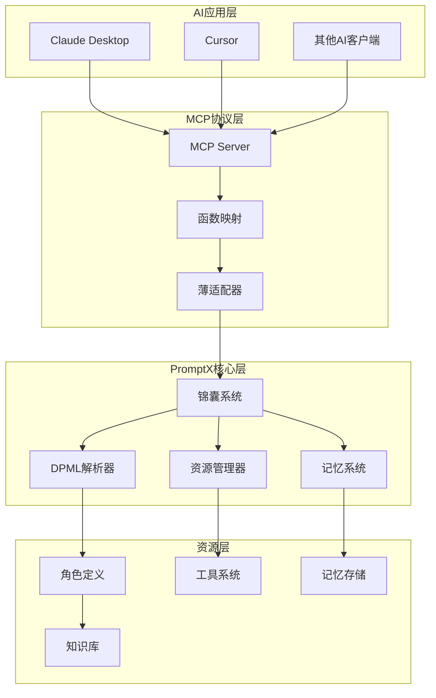
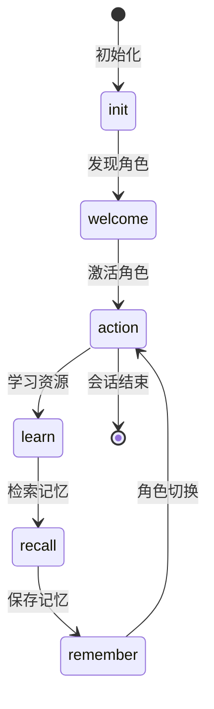

# PromptX技术架构深度分析

## 系统整体架构

PromptX采用分层架构设计，实现了"AI use CLI get prompt for AI"的创新理念。



## 核心技术组件

### 1. DPML (Deepractice Prompt Markup Language)

#### 设计理念
DPML是专为提示词工程设计的语义化标记语言，核心特点：
- **自然语言驱动**：提示词本质是自然语言的结构化表达
- **释义即实现**：AI理解语义的过程就是执行过程
- **语义透明性**：标签名称具有自解释性

#### 语法结构

```xml
<role>
  <personality>
    @!thought://judicial-thinking
    我是专业的法官，具备严谨的司法思维...
  </personality>
  <principle>
    @!execution://court-procedure
    @!execution://evidence-analysis
  </principle>
  <knowledge>
    @!knowledge://legal-system
    @!knowledge://civil-litigation
  </knowledge>
</role>
```

#### 核心特性

**1. 协议实现绑定**
```xml
<store:execution>
  # 存储操作通过execution协议实现
  具体的存储逻辑和流程
</store:execution>
```

**2. 引用解析机制**
- `@!` 强制引用：必须成功解析
- `@?` 可选引用：允许解析失败
- `@` 直接引用：基础引用方式

**3. 组合复用**
```xml
<memory>
  <store:execution>存储操作</store:execution>
  <recall:resource>检索操作</recall:resource>
</memory>
```

### 2. MCP (Model Context Protocol)

#### 技术架构
MCP是连接AI客户端和PromptX系统的桥梁，采用零开销函数调用架构：

```javascript
// 零开销调用路径
MCP请求 → 参数映射 → cli.execute() → PouchOutput → MCP响应
```

#### 六大核心工具

**1. promptx_init**
- 功能：初始化工作环境
- 参数：workingDirectory, ideType
- 返回：环境状态和资源统计

**2. promptx_welcome**
- 功能：发现可用的专业角色
- 参数：无
- 返回：角色列表和服务清单

**3. promptx_action**
- 功能：激活指定的专业角色
- 参数：role (角色ID)
- 返回：角色激活状态和能力

**4. promptx_learn**
- 功能：学习指定的专业资源
- 参数：resource (资源URL)
- 返回：学习内容和知识

**5. promptx_recall**
- 功能：检索相关记忆
- 参数：role, query
- 返回：相关记忆和上下文

**6. promptx_remember**
- 功能：保存重要信息
- 参数：role, content, tags
- 返回：保存状态确认

#### PATEOAS状态机



### 3. 资源管理系统

#### 目录结构
```
.promptx/
├── resource/
│   ├── role/              # 角色定义
│   │   ├── {roleId}/
│   │   │   ├── {roleId}.role.md
│   │   │   ├── thought/
│   │   │   ├── execution/
│   │   │   └── knowledge/
│   └── tool/              # 工具系统
│       ├── {toolId}/
│       │   ├── {toolId}.tool.js
│       │   ├── {toolId}.manual.md
│       │   └── package.json
└── project.registry.json  # 资源注册表
```

#### 资源发现机制
1. **注册表扫描**：读取project.registry.json获取资源索引
2. **文件系统遍历**：递归扫描.promptx目录
3. **类型识别**：根据文件后缀和命名约定识别资源类型
4. **依赖解析**：解析@引用关系，构建依赖图

### 4. 角色系统

#### 角色定义结构
```xml
<role>
  <oath>                    # 角色誓言（可选）
    @!judge-oath
  </oath>
  <personality>             # 人格特征
    @!thought://judicial-thinking
    核心身份描述
  </personality>
  <principle>               # 行为原则
    @!execution://core-workflow
    @!execution://quality-standards
  </principle>
  <knowledge>               # 专业知识
    @!knowledge://domain-expertise
    专业知识体系
  </knowledge>
</role>
```

#### 角色激活流程
1. **资源加载**：解析角色定义文件
2. **依赖解析**：递归加载@引用的资源
3. **语义渲染**：将DPML标记转换为自然语言提示词
4. **上下文构建**：构建角色的完整上下文
5. **记忆注入**：加载相关的历史记忆
6. **角色返回**：返回激活后的角色提示词

### 5. 工具系统

#### 工具接口规范
```javascript
class ToolInterface {
  constructor() {
    this.name = 'tool-name';
    this.version = '1.0.0';
    this.description = 'Tool description';
  }

  async execute(params) {
    // 核心执行逻辑
    return result;
  }

  getDependencies() {
    return {
      npm: ['dependency1', 'dependency2']
    };
  }

  getManual() {
    return 'manual content';
  }
}
```

#### 工具沙箱机制
1. **依赖隔离**：每个工具有独立的node_modules
2. **进程隔离**：工具在独立的Node.js进程中运行
3. **资源限制**：限制CPU、内存和执行时间
4. **错误隔离**：工具错误不影响主系统

#### 现有工具分析

**md2pdf工具**
- 功能：Markdown转PDF，支持中文优化
- 技术栈：Puppeteer + Marked
- 特性：批量处理、自定义样式、错误处理

**mermaid-chart-generator工具**
- 功能：生成Mermaid图表
- 技术栈：Mermaid + Puppeteer
- 特性：多格式输出、样式定制、高质量渲染

### 6. 记忆系统

#### 存储架构
```
记忆存储
├── 角色记忆 (按roleId分类)
│   ├── personal/     # 个人化信息
│   ├── project/      # 项目特定信息
│   ├── experience/   # 经验性信息
│   └── correction/   # 纠错性信息
└── 全局记忆 (跨角色共享)
    ├── common/       # 通用知识
    └── system/       # 系统配置
```

#### 检索策略
1. **关键词匹配**：精确匹配用户查询
2. **语义相关**：基于向量相似度的语义检索
3. **时空关联**：考虑时间和上下文的关联检索

#### 记忆分类处理
- **个人化信息**：用户背景、偏好、习惯
- **项目特定信息**：工作内容、进展、配置
- **经验性信息**：问题解决方法、教训总结
- **纠错性信息**：对AI回答的修正和澄清

## 关键技术实现

### 1. DPML语义渲染

#### 渲染流程
```javascript
// 简化的渲染流程
function renderDPML(roleContent) {
  // 1. 解析DPML标记
  const parsed = parseDPML(roleContent);
  
  // 2. 解析@引用
  const resolved = resolveReferences(parsed);
  
  // 3. 组装最终提示词
  const prompt = assemblePrompt(resolved);
  
  return prompt;
}
```

#### 引用解析算法
```javascript
function resolveReferences(content) {
  const references = extractReferences(content);
  const resolved = {};
  
  for (const ref of references) {
    const resource = loadResource(ref.protocol, ref.path);
    resolved[ref.id] = resource;
  }
  
  return substituteReferences(content, resolved);
}
```

### 2. 零开销MCP适配

#### 适配器设计
```javascript
class MCPAdapter {
  constructor(cliExecutor) {
    this.cli = cliExecutor;
  }
  
  async handleRequest(request) {
    // 直接函数调用，无命令行开销
    const result = await this.cli.execute(request.params);
    return this.formatResponse(result);
  }
}
```

#### 性能优化
- **预编译**：预先解析和缓存常用资源
- **延迟加载**：按需加载角色和工具
- **缓存机制**：缓存解析结果和渲染输出
- **连接池**：复用数据库和网络连接

### 3. 工具热加载

#### 动态加载机制
```javascript
class ToolLoader {
  async loadTool(toolPath) {
    // 动态导入工具模块
    const ToolClass = await import(toolPath);
    
    // 安装依赖
    await this.installDependencies(toolPath);
    
    // 创建工具实例
    return new ToolClass.default();
  }
  
  async installDependencies(toolPath) {
    const packageJson = await this.loadPackageJson(toolPath);
    await this.npmInstall(packageJson.dependencies);
  }
}
```

## 安全和性能考虑

### 1. 安全机制
- **工具沙箱**：隔离工具执行环境
- **资源验证**：验证资源文件的完整性
- **权限控制**：限制工具的文件系统访问
- **输入验证**：验证用户输入的安全性

### 2. 性能优化
- **资源缓存**：缓存常用资源和解析结果
- **懒加载**：按需加载角色和工具
- **并行处理**：并行执行独立的任务
- **内存管理**：及时释放不用的资源

### 3. 错误处理
- **异常捕获**：完善的异常处理机制
- **错误恢复**：自动恢复和重试机制
- **日志记录**：详细的错误日志和调试信息
- **优雅降级**：在错误情况下的优雅处理

## 扩展和定制

### 1. 角色扩展
- **角色模板**：提供标准的角色开发模板
- **插件机制**：支持第三方角色插件
- **版本管理**：角色的版本控制和更新
- **测试框架**：角色功能的自动化测试

### 2. 工具扩展
- **工具SDK**：提供工具开发的标准SDK
- **API集成**：支持外部API的集成
- **批处理**：支持批量处理和并行执行
- **监控报告**：工具执行的监控和报告

### 3. 协议扩展
- **自定义协议**：支持定义新的资源协议
- **语法扩展**：扩展DPML的语法支持
- **适配器开发**：支持新的AI客户端适配
- **中间件**：请求处理的中间件机制

## 技术创新点

### 1. 语义化标记
- **自然语言优先**：以自然语言为中心的设计
- **语义透明**：标签含义直观易懂
- **渐进增强**：从简单到复杂的渐进式语法

### 2. 零开销架构
- **直接函数调用**：避免命令行解析开销
- **预编译优化**：预先解析和缓存资源
- **智能缓存**：基于使用模式的缓存策略

### 3. 角色驱动设计
- **专业角色**：模拟真实专业人士的思维
- **上下文感知**：基于角色的上下文理解
- **记忆持久化**：跨会话的记忆保持

### 4. 工具生态系统
- **标准化接口**：统一的工具开发接口
- **沙箱安全**：安全的工具执行环境
- **热插拔**：动态加载和卸载工具

---

*本文档基于PromptX项目当前架构编写，随着项目发展可能会有更新。建议结合源代码进行深入学习。*